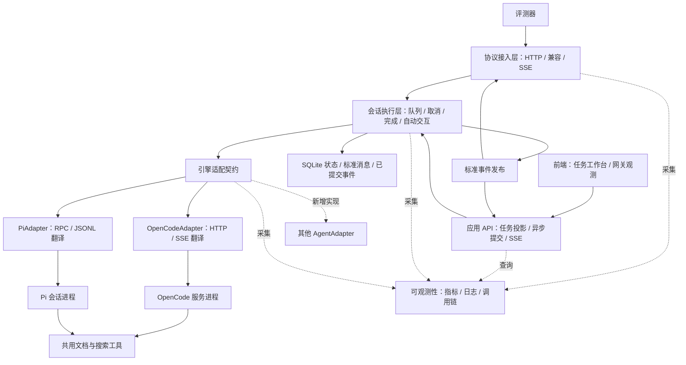
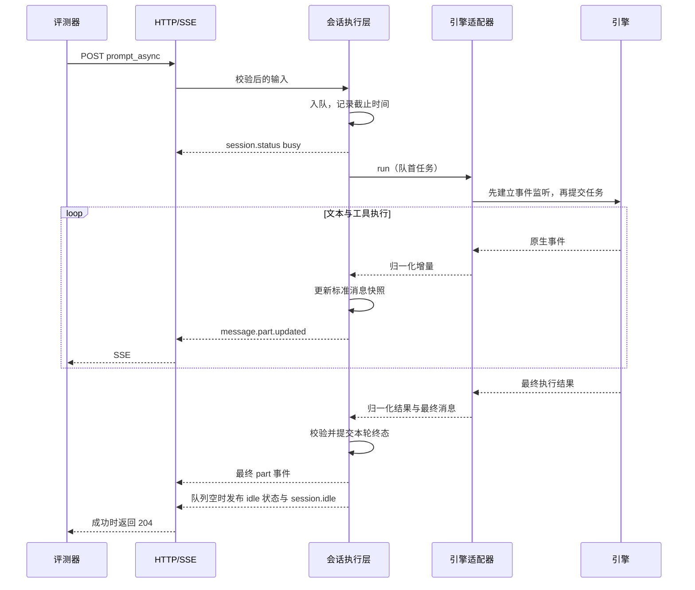

# AgentBridge 架构设计

状态：完整版本设计待审阅；前端工程已通过 CLI 初始化，业务尚未实现或通过 Windows 验证。设计入口见 [设计基线](docs/design/README.md)，术语、领域、契约、页面和完整验收分别在其专属文档维护。开发约束见 [DEVELOPMENT.md](DEVELOPMENT.md)。

首批引擎固定为 OpenCode 和 Pi，但引擎集合可通过新增适配器扩展。网关按启动配置选择一个引擎；不同引擎分别启动评测，不做运行中切换。本文以当前提供的需求清单为设计输入，赛题原文和两版协议的完整 schema 尚待核对。

## 1. 目标与边界

- Windows 10/11 原生运行，本地 Linux 开发；不将 WSL、Docker 或桌面登录作为网关启动前提。
- 一个 HTTP 网关，一套标准会话、消息、事件和任务执行流程，首批两个引擎适配器。
- 新增 Agent 只增加适配实现、启动注册、引擎配置和契约验证，不修改现有路由、会话执行逻辑或其他引擎。
- 提供一个前端应用，包含任务工作台和网关观测两个主模块；任务详情归属工作台，支持分派、交互和查看产物，观测模块覆盖整体健康、性能与故障。
- 默认使用本地 SQLite 保存会话、执行、消息、交互、产物元数据和事件；内存模式仅用于测试或显式评测配置。完整版本覆盖恢复、幂等和事件回放，不建设消息中间件、插件市场或跨引擎上下文迁移。
- Agent 负责规划和调用工具。网关负责执行控制、协议转换、轨迹记录，不再实现一套模型推理循环。
- 工具代码共用，实际运行在对应引擎的工具执行环境中；HTTP 路由不直接承担文档处理。

## 2. 分层与依赖



图中适配器表示可选实现，一次网关启动只选择其中一个，其他 Agent 为扩展位置，不提前创建实现。状态存储与事件发布是执行层内部模块，不是独立服务。

应用 API 与评测 API 同属协议接入层，共用会话执行层、持久化记录和事件发布器；它们可以提供不同的响应方式，但不各自维护任务队列。状态、消息与事件在同一事务提交，发布发生在提交之后。

| 层 | 负责 | 不负责 |
| --- | --- | --- |
| 前端应用 | 任务操作、过程与产物展示、整体指标与异常定位 | 模型调用、引擎进程、任务调度、判断任务成功 |
| 协议接入层 | HTTP 参数和 schema 校验、状态码、响应序列化、SSE 连接、旧版协议转换 | 引擎原生接口、执行队列、业务工具 |
| 会话执行层 | 会话生命周期、逐会话队列、运行状态、标准快照、成功/失败/取消收尾、交互策略 | OpenCode 或 Pi 的事件名和字段 |
| 引擎适配层 | 创建原生会话、目录和模型映射、发送与中止、原生消息和事件转换、交互回复 | 对外 HTTP 状态码、评测路由、网关队列 |
| 进程管理 | 子进程启动、退出、超时、输出管道、停止和有限重启 | 消息语义、任务成功判定、工具业务 |
| 共用工具 | 文档、文件、搜索等实际操作及结构化结果 | 网关会话状态、SSE、模型调度 |
| 可观测性模块 | 分层埋点、指标导出、结构化日志、关联调用链、观测查询 | 任务状态决策、引擎重启、替代业务状态存储 |

依赖约束：前端只调用本网关；路由只调用执行层；执行层只依赖适配契约；适配器可以使用进程管理模块；工具不反向依赖网关。引擎选择只出现在启动装配文件。共享类型只定义引擎无关的数据，不导入任何原生 SDK 或 HTTP 框架。

## 3. 模块划分

本次设计选择 TypeScript、Fastify、Node.js 24 LTS，文档工具使用独立 Python 虚拟环境。目标平台验证时锁定具体版本。Domain 定义纯领域类型和状态转换，Application 编排存储与引擎调用；数据库、HTTP 与原生协议不得进入 Domain。

```text
INSTRUCTION.md
code/
  package.json
  pnpm-lock.yaml
  pnpm-workspace.yaml
  tsconfig.json
  src/
    main.ts                     # 配置、选择适配器、启动与退出
    domain/
      types.ts                  # Session、Run、Message、Interaction、Artifact
      transitions.ts            # 状态转换、停止与唯一终态规则
      projections.ts            # TaskView 与 SessionStatus 派生规则
    contracts/
      application.ts            # 应用 API 与事件 schema
      evaluation.ts             # 赛题 schema，与原始协议核对
    storage/
      sqlite.ts                 # 事务、实体查询与已提交事件
      migrations/               # 可追踪数据库迁移
    gateway/
      routes.ts                 # 1.2 HTTP 接口
      app-routes.ts             # 前端任务查询、异步提交和产物接口
      compatibility.ts          # 1.1 差异转换，复用同一执行入口
      schemas.ts                # 赛题 schema、内部类型的协议序列化
      sse.ts                    # 连接、心跳、广播、慢连接处理
    runtime/
      sessions.ts               # 用例编排、队列、运行控制和收尾
      messages.ts               # 按 message/part ID 合并标准快照
      interactions.ts           # 待处理交互、自动策略、回复去重
    engines/
      adapter.ts                # 所有引擎必须实现的类型契约
      process.ts                # 子进程管理函数
      opencode/
        adapter.ts              # HTTP、目录上下文、会话映射
        events.ts               # 原生事件和消息翻译
      pi/
        adapter.ts              # RPC、会话进程映射
        events.ts               # 原生事件和消息翻译
    observability/
      metrics.ts                # 指标注册、采集与导出
      traces.ts                 # 执行与工具 span 关联
      logger.ts                 # 结构化日志，stdout 与文件
      routes.ts                 # 观测查询、健康检查、metrics
  web/
    src/
      App.tsx                   # 一个应用入口和两个主导航模块
      features/tasks/           # 列表、新建、详情、交互与产物
      features/observability/   # 总览、引擎、异常与资源观测
      components/ui/            # shadcn Base UI 组件
      lib/                      # HTTP 客户端、共享 SSE 与恢复
  tools/
    pi-extension.mjs           # 网关交互、权限与兼容模型注册
    pack.py                    # 源码交付包；办公能力通过 skill/MCP 提供
  config/
    opencode.json
    pi-settings.json
  test/
    contract.test.ts            # 同一套网关契约测试
    lifecycle.test.ts           # 并发、超时、中止和进程退出
    fixtures/                  # 小型文档与原生事件记录
```

这是模块边界，不要求先创建全部空文件。只在功能实现时创建对应文件；领域逻辑使用可测试的类型与函数，存储负责明确的事务和查询，不预设通用 Repository、Service 基类或依赖注入容器。

## 4. 数据归属

| 数据 | 唯一管理者 | 说明 |
| --- | --- | --- |
| 网关 session ID、title、created_at、directory | 会话执行层 | directory 创建后固定，验证存在且为目录 |
| 网关 run ID、队列、截止时间、取消状态 | 会话执行层 | 每次 prompt 独立，不能只用 session ID 关联终态 |
| 标准消息和 part ID | 消息模块 | SSE 与 GET 快照使用相同数据 |
| 网关 ID 与原生 ID 的双向映射 | 各引擎适配器 | 键包含进程实例代次，重启后拒绝旧事件 |
| 原生上下文与工具执行 | 引擎 | 网关快照不替代引擎内部上下文 |
| 权限和问题的待处理记录 | 交互模块 | 原生请求 ID 由适配器转换和反查 |
| SSE 连接和写缓冲 | SSE 模块 | 连接关闭即释放；不影响任务是否继续 |
| 前端任务状态和执行历史 | 会话执行层记录的投影 | 不以浏览器本地状态作为事实来源 |
| 可下载产物记录 | 会话执行层 | 关联 session/run，登记并验证真实文件 |

内部实体字段、关系、生命周期和不变量见 [DOMAIN](docs/design/DOMAIN.md)。Session 拥有固定目录、引擎与交互策略，Run 为执行子实体；queue 从已接受 Run 顺序获得，消息和产物按 Run 关联。`availability` 区分 ready、unavailable、deleting，不额外扩展赛题规定的对外状态枚举。

对外 `idle/busy` 由执行层计算：有正在运行或已接受的排队任务为 busy，全部收尾后才为 idle。引擎不可用通过请求错误和 session.error 表达，idle 本身不代表引擎健康。

每轮持久化记录包含 runId、输入、model、deadlineAt、state 和终态结果。AbortController、Promise、进程句柄和计时器只存在于运行上下文，不写数据库。终态只允许提交一次；清理计时器、解除等待请求也只执行一次。

前端的一个“任务”对应一个网关 session；一次执行或追加要求对应一个 run。任务状态由当前执行、队列、交互及最后一轮结果计算，不再引入第二个可以独立修改的 Task 状态机。

## 5. 引擎适配契约

适配器是类型契约，不要求抽象基类。为了满足实际的双向交互，除原需求中的方法外，补齐权限与问题回复。

| 方法 | 输入和结果 | 契约 |
| --- | --- | --- |
| `start()` | 无输入 | 完成进程或可执行文件检查；失败可明确定位 |
| `createSession()` | 网关 session ID、directory、title | 原生会话创建成功并建立映射后返回 |
| `run()` | session ID、run ID、parts、model、signal、事件回调 | 输出归一化增量；本轮真正结束后返回结果 |
| `abort()` | session ID、run ID | 确认本轮停止后返回；发送取消指令成功不等于停止成功 |
| `replyPermission()` | 交互 ID、once/always/reject | 转换成引擎原生回复 |
| `replyQuestion()` | 交互 ID、答案 | 转换成引擎原生回复 |
| `disposeSession()` | session ID | 中止和删除原生会话，清理映射与订阅 |
| `stop()` | 无输入 | 停止本适配器拥有的全部资源 |

`run()` 的归一化输出只有两类：

- 增量：消息/part 更新、权限请求、问题请求、必要的工具进度。
- 最终结果：completed、failed 或 aborted，包含可用于补齐快照的标准最终消息以及归一化错误。aborted 仅为适配器停止证据，执行层结合停止原因映射为领域 cancelled 或 timed_out，不作为 RunOutcome 对外暴露。

进程意外退出由适配器内部监听，并使受影响的在途 `run()` 及时失败。意外的编程或传输错误可以抛出，执行层仍须统一收尾。适配器不能直接写 HTTP 响应或向评测器广播。

不向执行层暴露独立的公共 `getMessages()`：原生消息拉取是适配器在最终收尾或流中断时的内部补偿手段。对外 GET 消息永远读网关标准快照，避免形成双重数据来源。

同理，底层长连接订阅由适配器内部管理；`run()` 回调取代公开的无范围 `subscribeEvents()`。原生消息 ID、当前运行边界及进程代次共同用于归属判定，不能把所有到达事件直接标成当前 run ID。

### 5.1 三个稳定边界

```text
引擎原生协议 -> EngineAdapter -> 内部消息 / 事件 / 结果
内部事件 -> SessionRuntime -> 领域转换、持久化快照与生命周期
内部快照 / 事件 -> Gateway serializer -> 赛题 1.2 / 1.1
```

- 原生协议差异在引擎适配器消化。例如模型结束、命令执行、工具结果翻译成内部语义。
- 赛题版本差异在协议接入层消化。例如事件包装、时间格式、状态码、字段别名。
- 内部标准是本网关的契约，不直接复用 OpenCode SDK 类型。Pi 和未来 Agent 不需要模拟 OpenCode 的全部 API。
- 上文的“标准消息快照”指内部标准数据；`info.finish=stop` 等具体 wire 字段由接入层序列化，完成依据仍由执行层统一掌握。
- 内部类型保留 text、tool、step 的必要语义和实际用量；不伪造引擎未提供的 token 或 cost，也不把原生响应原封不动塞进对外消息。

### 5.2 新 Agent 的接入规则

新增引擎按以下步骤执行：

1. 创建 `engines/<name>/adapter.ts`，实现同一 EngineAdapter 契约。
2. 在本引擎目录实现必要的事件转换和传输；简单协议可放同文件，复杂事件才独立 `events.ts`。
3. 在 `main.ts` 的静态名称到构造函数映射中注册一个入口。选择优先级固定为 `--engine > AGENT_ENGINE > opencode`，非法名称启动时报错。
4. 添加本引擎配置和启动文档；把公共工具目录、Python 路径、工具说明接入其原生配置方式。
5. 运行同一份契约与生命周期测试，再做实际样本验收。

装配入口只保留普通映射，例如 `opencode -> createOpenCodeAdapter`、`pi -> createPiAdapter`。不需要扫描目录、动态下载插件、反射注册或多层 Factory 类；增加一个映射项是允许的扩展成本。

适配器构造时接收配置、日志、工具位置以及 `onUnavailable` 回调。运行期回调只报告受影响的网关 session ID 和归一化错误，执行层据此使旧会话不可用并收尾；不让执行层查询原生进程或判断引擎类型。

| 差异 | 由谁处理 | 上层保持的契约 |
| --- | --- | --- |
| HTTP/SSE、JSON-RPC、SDK | 适配器内部传输 | run 的输入、归一化增量和最终结果 |
| 一个常驻服务、多会话进程、SDK worker | 适配器选择，进程模块提供基础操作 | 创建、隔离、取消和释放会话 |
| 原生会话是否持久化 | 适配器 | 保持上下文或明确不可用，删除释放拥有的资源 |
| 原生权限或问题接口缺失 | 适配器配置自动策略或小扩展 | 不阻塞评测，并满足已冻结的交互契约 |
| 模型命名、provider、认证方式 | 适配器配置和请求转换 | 使用请求指定的模型，无法支持时明确报错 |
| Skills、MCP、shell 工具加载方式 | 适配器配置 | 共用工具实现和产物契约 |

只返回最终文本、无法提供工具轨迹或无法可靠中止的 Agent，不视为已完成接入。必需能力不能靠 `capabilities=false` 跳过；应补齐适配或明确该引擎不符合评测条件。目录必须是真实执行目录，不是只写进提示词。

目前只固定文本输入和赛题所需工具轨迹，不提前建设任意模态或工具编排框架。未来增加能力时，先按实际需求扩展公共类型，再让适配器显式实现或拒绝，不能静默丢弃不支持的输入。

### 5.3 生命周期与进程管理的区别

`start/stop` 管理整个适配器；`createSession/disposeSession` 管理一个会话；`run/abort` 管理一轮任务。三个范围不能混用。

`process.ts` 只提供启动、等待退出、带期限停止及输出管理的函数。健康检查请求、重启影响范围和原生会话恢复由适配器定义，因为 HTTP 服务与逐会话 RPC 进程的含义不同。SDK 型引擎也可以在隔离 worker 或子进程中运行，不要求它伪装成 HTTP 服务。

任何新引擎必须验证：同一任务至多一次终态、取消后不会继续写文件、删除不会释放别的会话、共享进程退出会通知所有受影响会话、恢复进程不会自动重放原任务。

## 6. 任务执行流程



关键规则：

1. 成功返回 204 前，内部快照必须已包含最终 assistant、成功结束语义和完成 step，序列化后得到 `info.finish=stop` 和 `step-finish`；完整结构按赛题 schema 定义。
2. 工具调用后的中间模型步骤完成不等于整轮完成；不能见到任意 step-finish 就结束请求。
3. aborted、failed、输出截断不能强制转成成功。session.idle 只描述空闲，不能充当成功标记。
4. 排队任务在开始执行时才写入标准消息历史，防止未执行的 user 消息提前覆盖当前轮的最后一条 assistant。
5. 同会话还有排队任务时维持 busy，不在两轮之间发布虚假的 session.idle。每轮请求独立得到结果；协议若要求逐轮完成事件，须按原文另行核对。
6. 新一轮开始后，消息 GET 返回的是会话最新快照，不承诺返回上一次请求的历史时点。双并发 prompt 的评测读取语义需要在契约测试中明确。

## 7. 排队、中止、删除与故障

- 每会话有界 FIFO，网关控制调度；不再把任务交给引擎内部队列，避免双重排队。
- 不同会话在总资源上限内并行；资源饱和的请求返回 SERVICE_UNAVAILABLE，不无限创建进程。
- prompt 总预算默认 10 分钟，从接收开始计算，包含排队时间。排队超时不会启动引擎；运行超时必须发起取消。并发、队列、启动和停止配额见 DOMAIN，按 Windows 实测调整。
- HTTP prompt 客户端断开不自动中止任务，结果继续写快照；明确的 abort、超时或服务退出才取消。
- `/abort` 设计为停止当前轮并取消该会话已接受的队列，避免停止后自动继续执行；具体范围需对照赛题原文。所有等待请求必须得到明确收尾。
- 取消等待超时则升级为停止所属进程及其工具子进程。未确认停止前，不允许下一轮进入同一执行资源。
- 删除先标记 deleting 并拒绝新请求，再取消执行、清空队列、清理原生会话，最后删除标准记录。清理失败返回错误并保留必要清理信息，不返回虚假 ok。
- 引擎异常时在途请求返回 502 BAD_GATEWAY，并发布 session.error。服务暂时尚未就绪或达到资源上限返回 503 SERVICE_UNAVAILABLE。
- 引擎重启采用有限次数和退避，不自动重放未知执行结果的任务。网关启动后从 SQLite 的 Session 与 engine_bindings 重建适配器映射；只有原生上下文验证通过才把旧会话恢复为 ready，允许提交新一轮。
- OpenCode 校验持久化原生 ID 和目录，并中止外部服务可能残留的执行、确认 idle；Pi 校验 JSONL 文件头中的原生 ID 和目录后重新打开同一文件。缺失、损坏或不匹配不能回退为新原生会话。
- 网关停止和恢复启动失败只释放运行资源，不删除原生历史；原生会话和 Pi 文件只在显式删除或新建失败清理时移除。Pi 新会话在首轮模型响应之前即持久化会话头，避免空会话重启后丢失身份。
- 重启后若不能确认旧会话上下文恢复，旧会话标记 unavailable；查询快照和删除仍可使用，继续 prompt 返回明确错误，要求建立新会话。

仅重试明确未提交的启动操作、只读请求或引擎自身确认可重试的模型请求。网关不盲目重放可能已经写文件、删文件或发送消息的整轮任务。

## 8. OpenCode 接入边界

- 一个网关托管一个 OpenCode HTTP 服务进程；使用固定配置和独立状态目录，避免混入开发者已有会话。
- 就绪检查使用所锁定版本的健康接口，超时则启动失败。
- 原生 API 的 directory 上下文贯穿创建、prompt、消息、取消和交互回复；网关目录 body 转成适配器原生参数，不做进程级 `chdir`。
- 内部优先调用等待结果的 `/session/:id/message`，并消费原生 SSE；对外仍实现赛题的阻塞式 prompt_async。
- 优先订阅全局事件流并按目录和原生会话过滤，保证不同工作目录的会话都有轨迹。过滤所有不属于本网关的会话；具体包装结构以锁定版本为准。
- 事件翻译处理完整 part 与增量更新，最终读取或核对原生结果，避免断流导致快照缺少最后一段。
- 权限和问题通过原生回复 API 处理，相关原生 ID 保留在适配器映射中。
- 如果必须强停共享进程，该进程中的所有会话都是受影响对象，必须同时失败并收尾，不能只清理触发超时的一个会话。

## 9. Pi 接入边界

- 每个网关会话启动一个 `pi --mode rpc --no-session` 子进程，`cwd` 为评测工作目录；删除时退出进程即释放原生上下文。网关历史单独持久化，不依赖 Pi 原生会话落盘。
- 用 RPC 状态请求验证就绪并取得原生 session ID；不能把进程 spawn 成功当作引擎就绪。
- 网关调度到该会话时，先按需设置模型，再发送 prompt；原生接受响应不是本轮完成响应。
- 以锁定版本的最终收敛事件及成功消息结束原因联合判定成功。当前官方文档使用 agent_settled；agent_end 可能仍有自动续跑。
- 文本和工具事件翻译成标准消息；保留工具输入、输出、失败与时间，不能只记录最后一段回答。
- 读取 JSONL 使用流式 UTF-8 解码并按 LF 分帧，处理跨数据块字符、半条记录及尾部 CR；不解析 TUI 文本。
- 所有第三方扩展交互也必须接入自动回复策略；不依赖标准输入之外的人机界面。
- 一个会话一个进程的资源成本明确，以会话上限控制。只有实测资源不足时再改为托管 SDK 多会话；当前进程模型本身须完成资源限制与故障验收。
- Pi 内存上下文随进程退出丢失，按上一节的 unavailable 策略处理旧会话，不伪造上下文恢复。

## 10. 自动交互与工具

交互记录流程：收到原生请求 → 建立 pending 记录 → 发布 asked 事件 → 自动策略或外部 reply 抢占处理权 → 调用适配器回复 → 确认成功后移出待处理列表。

- 评测模式权限默认 always；外部 reply 只能处理尚未被自动策略认领的请求。
- 状态至少区分 pending、replying、resolved，防止自动回复和 HTTP 回复双发。
- 回复失败不删除记录；按原生协议核对处理结果，必要时使本轮失败，不能让引擎无限等待。
- 问题按预设映射、原生默认选项或已配置的无人工策略回答；不统一回答“是”。
- Pi 默认没有权限弹窗；如果赛题要求实际演示权限与问题链路，增加最小扩展发起对应请求，而不是凭空广播事件。

两引擎使用相同的 Python 环境、工具路径和说明文件，通过已有命令执行能力调用共用脚本。MCP 不是工具共用的必要条件，不把另建 MCP 服务作为当前交付依赖。

工具输入采用明确的参数或 JSON，输出结构化结果与实际产物路径。退出码表达执行失败。文档另存完成后重新打开验证；高保真修改需要针对真实样本检查表格、公式、样式和资源关系。

网关只是把工具说明与环境传给引擎，不能在 HTTP 请求前后自行执行任务以伪造 Agent 轨迹。搜索、Outlook 和 WeLink 的网络、登录及应用依赖分别验收，不由“引擎支持 shell”推导为业务已支持。

## 11. SSE、错误与可观测性

- 标准事件先写快照再发布。message/part ID 稳定，完整对象按 ID 覆盖，增量只应用一次。
- GET /event 对评测器输出所有本网关会话事件；session ID 在事件字段中用于区分，不默认要求客户端订阅单会话。
- 连接立即发送 server.connected，每 15 秒发送 server.heartbeat；心跳属于网关，不依赖引擎原生周期。
- 响应采用 SSE 正确的头和帧格式；慢连接达到缓冲上限则断开，不能让一个客户端阻塞任务执行或耗尽内存。
- 应用事件持久化并支持保留窗口内的 Last-Event-ID 回放；过期游标明确要求 resync 并恢复快照。评测事件包装与游标能力按原文核对，不能将应用扩展字段直接塞入评测 payload。
- 引擎事件源断开与评测 SSE 客户端断开是两种故障：前者要重连并补齐原生消息；不能恢复轨迹时明确记录失败或缺失，不假称轨迹完整。
- 请求校验失败为 400 VALIDATION_ERROR，不存在为 404 NOT_FOUND，内部异常为 500 INTERNAL_ERROR，引擎失败为 502 BAD_GATEWAY，暂不可服务为 503 SERVICE_UNAVAILABLE；取消与超时的对外 body 细节按赛题原文冻结。
- 日志包含 requestId、sessionId、runId、engine、进程代次、耗时与错误分类；stdout 和文件同时输出，密钥不写入日志。
- 服务关闭时拒绝新请求、取消在途运行、关闭 SSE、停止所属进程并刷完日志；不终止不属于本网关的进程。

## 12. 验证与实施顺序

1. 设计基线：先审阅总体方案、统一术语、Domain、应用契约、页面和完整验收；补齐 1.2 schema、1.1 的八个路由及字段差异、事件包装、取消语义和完成判定。
2. Windows 可行性：两引擎固定版本，无交互启动，中文目录读写，指定模型，工具调用，中止及清理。
3. 领域与网关：状态转换、SQLite 迁移、事务、队列、幂等、恢复、消息合并和 HTTP/SSE，用可控测试适配器验证故障和并发。
4. OpenCode 闭环：全局事件过滤、目录上下文、真实消息完成、权限/问题自动回复和原生删除。
5. Pi 闭环：RPC 分帧、进程会话映射、模型设置、最终收敛与取消；复用同一网关契约测试。
6. 前端闭环：任务操作与详情、网关观测、刷新恢复、中止、交互回复和产物访问；同步验证指标口径与故障定位。
7. 文档能力：双引擎调用相同工具，对样本产物做独立检查。
8. 干净 Windows 交付：两组启动命令、锁定依赖安装、全部样本与失败原因报告。

必须覆盖的故障包括：同会话双 prompt、不同目录双会话、工具多轮、重复/迟到事件、SSE 断开、运行超时、取消超时、busy 删除、引擎崩溃、重启后旧会话请求，以及自动回复和外部回复竞争。

前端需验证重复点击提交、请求超时后重试、刷新时事件与快照交错、SSE 重连、网关重启、任务被另一页面删除、取消尚未完成和产物文件不存在。列表和详情应在这些情况下保持服务端状态一致。

## 13. 仍需依据原文冻结的事项

- 通用规范 1.2 与 myagent 1.1 的完整字段、状态码、事件包装及八个兼容路由。
- “全部必发”是否要求每个引擎实际演示 question/permission，还是仅要求支持发生时的处理。
- abort 是否取消排队任务；取消轮的消息完成格式和 prompt HTTP 响应。
- 并发 prompt 时裁判读取最新快照的预期，以及是否需要完整 SSE 重放。
- Windows 沙箱版本、依赖安装权限、模型 endpoint、可用网络、办公应用与登录态。

这些不确定项不改变上述分层，但会影响具体 schema、运行策略和验收断言。

## 14. 已核实的引擎资料

- OpenCode Server：https://opencode.ai/docs/server/
- OpenCode 接口类型：https://raw.githubusercontent.com/anomalyco/opencode/dev/packages/sdk/js/src/v2/gen/types.gen.ts
- OpenCode Windows：https://opencode.ai/docs/windows-wsl/
- Pi RPC：https://raw.githubusercontent.com/badlogic/pi-mono/main/packages/coding-agent/docs/rpc.md
- Pi Windows：https://raw.githubusercontent.com/badlogic/pi-mono/main/packages/coding-agent/docs/windows.md
- Pi 扩展与工具：https://raw.githubusercontent.com/badlogic/pi-mono/main/packages/coding-agent/README.md

以上主分支和在线文档会变化。开发时以锁定版本生成的 schema 和实测行为为准。

## 15. 前端：一个应用，两个主要模块

前端是完整任务工作台，一个应用和一次部署，主导航为“任务工作台” `/tasks` 和“网关观测” `/observability`；`/tasks/:id` 是任务工作台的下级详情路由。一个任务的执行详情不能替代网关整体观测；两者共享任务标识和时间范围，允许从异常定位到具体任务。页面操作与异常状态以 [FRONTEND](docs/design/FRONTEND.md) 为准。

### 15.1 任务工作台 `/tasks`

- 以任务列表为主体，显示标题、状态、当前引擎、模型、工作目录、创建时间、执行耗时和最近活动。
- 支持按状态筛选、按标题或 ID 搜索；点击任务进入详情。
- 新建任务使用侧栏或对话框，填写任务要求、服务端工作目录、可选标题和模型。
- 引擎显示本网关当前启用的 OpenCode 或 Pi，保持只读。一个实例只有一个引擎，不提供会让人误以为能热切换的下拉框。
- 当前工作目录是网关主机的路径，不把浏览器本机选择的文件夹误当成远端目录；新建时由服务端校验路径。
- 允许查看运行中、已结束和引擎不可用任务；整体运行指标放入网关观测模块，不塞进任务列表。

列表首屏优先展示正在执行和等待处理的任务，紧凑排列表格信息。页面使用常规导航与工具栏，不以大型欢迎区或统计卡片占据操作空间。

### 15.2 执行详情 `/tasks/:id`

- 顶部固定展示任务标题、执行状态、引擎、模型、耗时，以及中止操作。
- 主区域按轮次展示用户要求、Agent 输出和工具调用；工具参数、结果和错误可展开查看。
- 详情内部使用“执行过程”和“结果与文件”两个标签；输出文件可下载，文本类结果可预览。
- 等待问题或权限时显示就地回复控件；自动处理过的请求显示处理结果，不再允许重复覆盖。
- 底部可以追加任务要求，进入同一 session 的下一轮；排队状态明确显示。
- 中止请求发出后显示“正在停止”，只有服务端确认停止才显示“已取消”。
- 展示引擎实际提供的回答、工具记录和进度，不承诺展示模型未公开的内部推理。

桌面采用主执行区加可收起的任务信息侧栏；窄屏切换为单列。表格、工具日志和长路径允许合理换行或局部滚动，不让整页横向溢出。

### 15.3 状态与交互策略

| 页面任务状态 | 服务端依据 |
| --- | --- |
| 未开始 | session 已创建，尚未接受执行轮次 |
| 排队中 | 已接受的 run 尚未开始 |
| 执行中 | 当前 run 正在运行 |
| 等待回复 | 当前 run 有未解决且需要人工处理的交互 |
| 正在停止 | 已请求取消，尚未确认执行停止 |
| 执行结束 | 最后一轮正常完成且无后续任务 |
| 执行失败 | 最后一轮失败且无后续任务 |
| 已超时 | 最后一轮期限到达且停止已确认 |
| 已取消 | 最后一轮确认取消且无后续任务 |
| 引擎不可用 | availability 为 unavailable |
| 正在删除 | availability 为 deleting |

任务结果与执行状态分开展示：Agent 正常结束不自动证明产物通过业务验收。页面直接展示产物检查结果；未验证时不标记“验收通过”。

评测会话默认自动权限/问题策略。网页创建会话可以显式选择交互策略，并保存到会话记录；评测 API 的默认值不受网页设置影响。完整实现自动与人工观察模式，待处理交互按策略等待或立即处理。自动回复与手工回复通过同一处理权竞争逻辑去重。

### 15.4 应用 API 与评测 API

| 应用接口 | 用途 |
| --- | --- |
| `GET /api/runtime` | 当前引擎、实例标识、就绪状态和配置允许的模型选项 |
| `GET /api/tasks` | 持久化会话的任务列表投影，支持筛选与分页 |
| `POST /api/tasks` | 创建 session 并接受首轮任务，返回 202 与 taskId/runId |
| `GET /api/tasks/:id` | 任务、轮次、消息、交互、产物和快照版本 |
| `POST /api/tasks/:id/runs` | 追加要求，返回 202 与 runId |
| `GET /api/events` | 应用所需的标准状态与消息事件 |
| `GET /api/artifacts/:id/content` | 访问服务端登记且验证过的产物 |

中止、删除、权限回复和问题回复先复用已有的会话及交互接口，不为前端复制同义控制接口。

执行层提供统一的 `enqueue()`，同步返回已接受的 run 记录和内部 completion Promise。评测路由等待 completion 后返回 204；应用路由在接受成功后立即返回 202。应用路由不绕行或内部调用阻塞的评测 HTTP 路由。

`POST /api/tasks` 在原生会话创建和任务接收成功后才返回 202 与 AcceptedRun；失败则清理本次新建会话或保留明确失败记录供查询。网页使用 submissionId 去重提交，requestId 仅关联一次 HTTP 请求。同键同内容返回原接收结果，不同内容返回冲突；去重结果与 Run 接收在同一事务持久化。去重窗口、处理中查询和重启不确定结果见 [CONTRACTS](docs/design/CONTRACTS.md)，不承诺外部副作用 exactly-once。

应用扩展接口不修改赛题路由、响应结构或 SSE 包装；它们仍只读取和调用会话执行层。评测 API 创建的会话也可以在同一可信环境的工作台中观察，不复制一套数据。

产物以 ID 访问，不接受浏览器传任意绝对路径下载。服务端登记文件时关联会话与轮次，访问时重新验证文件存在、类型、允许目录及符号链接解析后的实际位置；目录记录不是文件访问权限的替代。只预览允许的文本类型，不直接执行或内嵌任意 HTML 产物。

### 15.5 刷新、断线与部署

- 前端不是执行器：浏览器关闭、刷新或 SSE 断开都不会取消任务。
- 使用 GET 快照加 SSE 更新；每个前端应用维持一条共享事件连接，按当前视图消费事件。
- 应用快照和事件包含 instanceId、storeId、revision 与事件 cursor，来自一致的事务读写。revision 标记事务，eventId 标记单条事件；一笔事务可以发出多个事件。它们是应用协议元数据，不塞入评测协议。
- 首次加载先建立事件流并缓冲，再读取快照与 cursor，应用快照后消费 cursor 之后的事件。重连在保留窗口内回放，窗口外走同一快照恢复流程。对外发送完整更新对象，避免重复文本增量拼接。
- 快照是该 revision 对应的不可变序列化副本；不能在异步读取期间混入更晚状态再标记旧 revision。
- 回放保留窗口外的缺口通过重新读取任务和轮次快照恢复；原始引擎事件不是永久保存承诺，消息、工具与交互事实按各自保留策略维护。
- instanceId 变化表示网关重启，前端失效缓存并重新加载。默认持久化历史仍可查询，旧未完成 Run 被明确收尾，旧绑定不可恢复时标记 unavailable；不静默创建同名任务重跑。
- 前端构建成静态资源，由网关同源提供；开发时可以独立启动前端开发服务器。前端代码不导入进程、适配器或密钥配置。
- 该方案是单可信环境的工作台。以后开放给多用户时，列表、事件、任务控制和产物必须共用同一身份与访问范围校验，不能仅靠页面隐藏操作实现隔离。

前端固定采用 React + TypeScript + Vite，组件使用 shadcn/ui 的 Base UI 版本，样式使用 Tailwind CSS 4，禁止混用 Radix。shadcn CLI 配置为 `base-nova`，通过 CLI 按需引入组件。具体初始化与编码约束见 [开发规范](DEVELOPMENT.md)。两端共享或生成应用协议类型，前端不依赖后端实现模块。

### 15.6 网关观测 `/observability`

观测服务于持续运行中的定位和决策，不是展示装饰性图表。一个主模块内使用四个标签，不再建立独立前端：

| 标签 | 内容 | 下钻操作 |
| --- | --- | --- |
| 总览 | 网关与引擎健康、任务流入和终态速率、执行成功率、队列积压、耗时趋势、近期异常 | 按时间范围进入异常和任务列表 |
| 引擎与工具 | 当前启用引擎版本、就绪/重启、执行耗时、取消耗时、工具错误分布、实际可得用量 | 进入对应失败轮次与工具记录 |
| 资源与连接 | 网关及可采集的引擎资源、并发配额、消息存储、SSE 连接与背压、事件源断线 | 查看饱和资源与受影响任务 |
| 异常与调用链 | 按错误类别、阶段、时间筛选，关联日志、执行 span、任务 ID | 跳到任务详情对应轮次和工具调用 |

顶部显示时间范围、自动刷新开关、采集时间与数据是否陈旧。空数据、未采集、引擎不支持及实际零值必须区分，不能全部显示为 0。图表下保留可比较的表格；不预设告警已连接外部通知渠道。

单实例只有一个启用引擎，因此当前页不伪造 OpenCode 与 Pi 的实时并排比较。历史任务保留创建时的 engineId，跨引擎历史比较只使用真实留存数据；实时指标跨重启的持续历史由持久化观测后端或真实评测报告提供。

## 16. 可观测性设计

### 16.1 指标、日志、调用链的职责

- Metrics 回答“出现了多少、持续多久、是否恶化”，用于趋势、容量和告警。
- Logs 回答“具体发生什么错误”，记录分类、阶段和上下文，默认不记录完整 prompt、文件正文或密钥。
- Traces 回答“时间花在哪个阶段”，关联接收、排队、引擎执行、可观察的工具调用、最终收尾和取消。
- 业务快照回答“当前任务是什么状态、有哪些产物”，仍由会话执行层管理。指标不是任务状态的事实来源。

埋点靠近职责所属模块：HTTP 层记录接口数据，执行层记录任务和队列，引擎适配器记录协议调用与原生用量，进程模块记录启动退出。使用现有标准指标与 tracing 库，不通过抓取日志文本反推出指标，不自制时间序列数据库。

### 16.2 指标目录与采集归属

以下名称为拟定的 metric family，具体 bucket 与标签在实现时集中定义。计数用 Counter，当前值用 Gauge，耗时和尺寸分布用 Histogram。

| 领域 | 关键指标 | 拟定指标族 / 来源 |
| --- | --- | --- |
| HTTP 接入 | 请求速率、4xx/5xx、在途请求、响应耗时 | `agentbridge_http_requests_total`、`http_inflight`、`http_request_duration_seconds`；HTTP 层 |
| 请求接收 | 新任务接收量、重复提交、配额拒绝 | `runs_accepted_total`、`submissions_deduplicated_total`、`admission_rejections_total`；执行入口 |
| 任务执行 | 运行数量、完成/失败/超时/取消量 | `runs_active`、`runs_finished_total{outcome}`；执行层 |
| 调度队列 | 排队数量、容量、最老任务入队时间、等待分布 | `queue_depth`、`queue_capacity`、`queue_oldest_enqueued_timestamp_seconds`、`queue_wait_seconds`；执行层 |
| 执行体验 | 端到端耗时、实际执行耗时、首个可见进度耗时 | `run_duration_seconds{phase}`、`run_first_progress_seconds`；执行层 |
| 引擎健康 | 就绪、进程数量、启动失败、异常退出、重启量 | `engine_ready`、`engine_processes`、`engine_starts_total{outcome}`、`engine_exits_total{reason}`、`engine_restarts_total`；适配器/进程模块 |
| 引擎调用 | 原生 API/RPC 调用次数、错误、耗时 | `engine_requests_total{operation,outcome}`、`engine_request_duration_seconds`；适配器 |
| 工具调用 | 调用量、失败量、执行耗时 | `tool_calls_total{tool,outcome}`、`tool_duration_seconds`；适配器标准化工具事件 |
| 取消与清理 | 取消量、停止耗时、升级强停、清理失败 | `cancellations_total{reason}`、`cancellation_duration_seconds`、`forced_stops_total`、`cleanup_failures_total`；执行层/适配器 |
| 权限与问题 | 待处理数量、等待耗时、自动/人工回复量、回复失败 | `interactions_pending{kind}`、`interaction_wait_seconds`、`interaction_replies_total{kind,mode,outcome}`；交互模块 |
| 模型用量 | 输入/输出/缓存 token、已知重试、已报告或估算费用 | `model_tokens_total{kind}`、`model_retries_total`、`model_cost_usd_total{source}`；仅依据原生可观测数据 |
| SSE 与事件 | 客户端连接数、输出字节、慢连接断开、上游重连/解析失败/已知缺口 | `sse_connections`、`sse_bytes_sent_total`、`sse_disconnects_total{reason}`、`engine_event_errors_total{reason}`；SSE/适配器 |
| 消息与产物 | 会话/消息/产物记录数量、内存配额、登记与校验失败 | `stored_records{kind}`、`artifact_checks_total{outcome}`；状态存储与产物登记 |
| 运行资源 | CPU 时间、RSS、堆内存、GC、事件循环延迟、磁盘余量 | 复用运行时标准指标；Windows 子进程与磁盘数据由平台采集能力提供 |

表中第二行起省略统一的 `agentbridge_` 前缀。不是每个指标都携带 engine/model/tool 的全部标签，按诊断需要选择最少的维度。

子进程 CPU/RSS 不由网关自身 process 指标代替。完整实现包括目标平台可得的进程采样，无法获得时显示未采集并记录验收限制，不能凭运行任务数估算内存。TS 网关观察事件循环延迟。

### 16.3 统计口径

1. 任务执行单位是 run。一个 session 可以有多轮，不能把 session 数当作执行次数。
2. 202 代表接收成功；204 代表按赛题接口约定完成；HTTP 请求成功率与 run 执行成功率分别统计。SSE 长连接耗时不能混入普通业务 API 的 P95。
3. `runs_finished_total` 的 outcome 为互斥终态：completed、failed、timed_out、cancelled。超时后即使调用 abort 清理，也只计一次 timed_out，不能再加一次 cancelled。
4. 默认执行成功率为 completed / (completed + failed + timed_out)，按同一窗口内结束的 run 计算；主动取消另列。若展示全部接收任务的完成比例，则单独命名并包含仍在排队或执行中的任务。
5. 端到端耗时为接收到终态确认；排队等待为接收到开始执行或排队终止；执行耗时为开始到终态，包含执行中的交互等待。取消耗时可能与执行耗时重叠，不把这些数值全部相加。
6. 首个可见进度从 run 开始到第一次文本或工具进度，不能标成模型 TTFT。只有原生模型请求边界与首 token 都可观察时才增加真正的模型 TTFT。
7. 用量如果是累计快照，只累计增长差值；最终快照和流式更新不能重复加账。区分输入、输出、缓存读写及其原生口径；无法取得的数据标记 unavailable。
8. 费用区分 reported 和 estimated；估算必须带模型价格配置版本和币种。未配置价格或模型未知时不显示虚假的 0 元，不能把 estimated 当账单。
9. 工具失败不必然导致 run 失败，Agent 可能恢复成功；工具结果和任务终态分别统计。业务验收通过率另外来自实际产物校验或评测结果。
10. 分位数用同一窗口 Histogram 计算，跨实例合并桶后再求分位数，不平均各实例 P95；样本不足或没有观测时不显示为 0。

普通操作耗时、模型任务耗时和排队耗时需要不同的 bucket 范围，后两者必须覆盖分钟级执行。指标的观察点由终态一次提交保护，取消、重启和重连不能重复记账。

### 16.4 标签、日志与追踪边界

- 指标标签限定为有限集合，例如规范化 route、method、status_class、engine、operation、outcome、error_category，以及已配置模型和工具名称。
- sessionId、runId、requestId、traceId、PID、任意路径、prompt、原始错误文本不得作为指标标签；它们属于日志字段或 trace 属性。动态工具名称须归一化并限制集合规模。
- trace 根覆盖一个 run；接收 HTTP 请求通过关联链接指向 run，不能让已经返回 202 的 HTTP span 伪装成仍在执行。
- 只创建可实际观测的 span。引擎只暴露整轮时间时，不编造内部 LLM 请求和工具子步骤；原生 trace 可用时再关联。
- 日志关联 requestId/sessionId/runId/traceId、引擎和进程代次；错误包含已归类原因与可定位的阶段。
- 日志文件轮转、内存近期记录、trace 缓冲和指标标签都有容量上限。导出器异常必须有界降级，不能无限堆积遥测数据或阻塞任务。
- 从指标图表下钻到日志时携带时间范围与低基数维度，再在日志中找到具体 run；不为实现点击跳转给每个任务创建指标时间序列。

### 16.5 健康检查、异常提示与数据服务

| 接口 | 语义 |
| --- | --- |
| `GET /health/live` | 网关进程和事件循环能够响应；不发起模型推理 |
| `GET /health/ready` | 网关已完成初始化，当前引擎具备接收会话的必要条件；不健康时返回 503 |
| `GET /metrics` | 导出标准指标，供 Prometheus 抓取 |
| `GET /api/observability/overview` | 当前健康、配额、统计口径与聚合结果 |
| `GET /api/observability/series` | 受限指标集合、时间范围和分辨率的趋势查询 |
| `GET /api/observability/errors` | 有界近期异常列表，按时间、阶段、类别分页过滤 |
| `GET /api/observability/runs/:runId` | 当前保留窗口内该轮的日志和可观察 span；与业务任务详情关联 |

Pi 按会话启动进程，ready 不能要求永远存在一个空闲 Pi 进程；使用可执行文件、配置及启动前提检查，并结合实际启动失败更新健康。就绪不保证下一次模型调用成功，配额短时满载主要由接收拒绝和饱和指标表达，避免把正常排队全部当成进程宕机。

首批异常提示包括：引擎持续不就绪、短期连续重启、队列最老等待超过预算、执行失败率异常且样本量足够、取消长时间未完成、资源持续饱和、上游事件持续断线及遥测数据陈旧。阈值依据运行预算和负载基线配置，并设置持续时间，避免瞬时波动触发。

进度长时间未更新只提示“缺少进度”，不能仅凭没有 token 或工具事件判断任务卡死并重放。自动取消仍由明确的任务截止时间或健康故障策略决定。

### 16.6 本地运行与企业观测接入

完整交付必须有观测页面、上述核心埋点、结构化日志、运行关联和 metrics 导出。为支持无额外服务的沙箱运行，保留有界本机窗口：每 5 秒采样，默认最多 1 小时的指标聚合快照，以及有上限的近期异常/span。业务持久化与观测保留周期独立；复用标准指标库的 counter/gauge/histogram 数据，不另写第二套事件计数器。

本地观测窗口按实例代次划分；历史不足、采集间断、计数器重置和进程重启在查询结果中明确标记。趋势只覆盖已采集窗口，不能展示伪造的 24 小时或 7 天历史。浏览器每 5 秒查询聚合指标，任务文字走 SSE。

企业部署需要跨实例、跨重启的持续观测时，接 Prometheus 保存指标，使用 OpenTelemetry 导出 traces 到现有追踪后端，日志接企业现有收集系统。查询层读取相应后端，前端页面和埋点位置保持稳定。不要求评测环境额外启动整套观测平台，也不在网关中实现告警投递服务或通用日志搜索引擎。

metrics、异常、trace 与业务任务接口一样需要部署层访问控制；企业多租户下必须进一步区分运维可见范围和任务用户可见范围。模型凭据、原始文件内容不能经观测接口旁路泄露。

### 16.7 验收重点

- 成功、失败、超时、主动取消、排队取消各一次，检查计数与耗时只记录一次。
- 前端提交 202 后引擎失败，验证 HTTP 接收成功与任务失败两个指标同时正确。
- 同一原生累计 token 事件重放，验证用量不重复累计；未知费用显示未提供。
- 共享引擎进程崩溃，验证受影响 run 各自收尾，而进程异常退出只计一次。
- 故意制造慢 SSE 客户端、上游断线和遥测导出失败，验证各自指标可区分且资源有界。
- 网关重启、没有样本和内存窗口过期时，页面不能把缺失历史显示成成功率 100% 或耗时 0。

参考：Prometheus Instrumentation（https://prometheus.io/docs/practices/instrumentation/）、Histograms（https://prometheus.io/docs/practices/histograms/）、OpenTelemetry Signals（https://opentelemetry.io/docs/concepts/signals/）。
