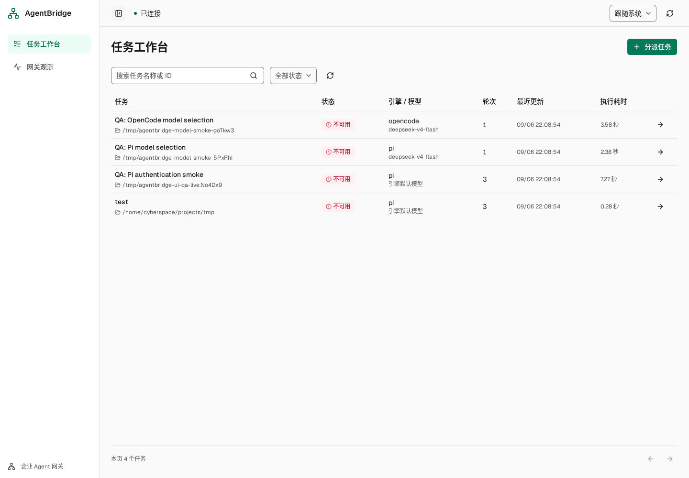

# AgentBridge

AgentBridge 将 Pi 和 OpenCode 接入同一个任务工作台，提供统一 HTTP/SSE 接口、执行记录、交互审批、交付物和运行观测。后端使用 TypeScript、Fastify 和 SQLite，前端使用 React、shadcn Base UI 和 Tailwind CSS 4。



## 功能

- 按任务选择 Pi 或 OpenCode，并从对应引擎的可用目录中选择供应商和模型。
- 配置页面管理 OpenAI 兼容模型、Skill 目录、OpenCode MCP 和 Pi 插件；支持 `.env` 及用户原生配置。
- 创建、搜索、筛选任务，查看流式输出、工具调用、交互记录和诊断，支持追加执行、停止与删除。
- 查看和下载交付物，处理权限审批与反问。
- 按引擎查看执行结果、资源、工具、Token/费用和异常，提供 Prometheus 指标。
- SQLite 保存任务历史，SSE 支持断线回放；同一会话串行，不同会话默认最多并发 4 轮。
- 桌面侧栏收起/展开、手机导航、浅深主题；内容区占满视口，长列表内部滚动，空态和分页保持稳定布局。

## 快速启动

需要 Node.js **>= 22.21.0** 和 pnpm **10.33.2**。安装入口是 `code/`，Pi 和 OpenCode CLI 均由项目依赖提供。

```sh
cd code
pnpm install --frozen-lockfile
pnpm build
pnpm web:build
```

先准备所用引擎的模型认证：

- OpenCode 读取其 provider 配置和认证信息。
- Pi 默认使用 `code/.agentbridge/pi/` 下的隔离配置。已有 Pi 配置时，可通过 `ENGINE_B_CONFIG_DIR` 指定目录，目录内的模型和认证必须匹配。

例如，在 Linux/macOS 上复用已有的 Pi 配置：

```sh
ENGINE_B_CONFIG_DIR="$HOME/.pi/agent" pnpm start --engine pi
```

PowerShell 对应写法：

```powershell
$env:ENGINE_B_CONFIG_DIR = "$HOME\.pi\agent"
pnpm start --engine pi
```

如果已按默认目录或环境变量配置模型认证，直接执行 `pnpm start` 即可。

打开 [任务工作台](http://127.0.0.1:3000/tasks) 或 [运行观测](http://127.0.0.1:3000/observability)。服务同时注册两个引擎，`--engine` 只指定未显式选择时的默认引擎，默认值为 `opencode`；新任务切换引擎无需重启。

访问 `/settings` 管理 OpenAI 兼容模型、Skill 目录、OpenCode MCP 和 Pi 插件。也可在 `code/.env` 配置，字段见 [env 示例](code/.env.example)。办公能力由安装的 skill 或 MCP 提供，网关不再内置 Office/Python 工具。完整配置见 [安装与验收](INSTRUCTION.md)。

页面配置保存在 `AGENT_DATA_DIR/settings.json`，API Key 保存后只返回掩码。Pi 变更对新建任务生效；OpenCode 变更需要重启网关并新建任务。Pi 的 MCP/subagent 需安装对应插件并遵循插件自身的配置格式；本地 Skill 管理仅增删目录引用，不删除原文件。配置优先级、示例和接口见[配置使用示例](INSTRUCTION.md#配置使用示例)与[配置管理-api](INSTRUCTION.md#配置管理-api)。

## 局域网访问

在 `code/` 中启动，保留需要的模型配置环境变量：

```sh
ENGINE_B_CONFIG_DIR="$HOME/.pi/agent" pnpm start --engine pi --host 0.0.0.0 --port 3000
```

同一局域网的设备访问 `http://<服务器局域网 IP>:3000/tasks`，并确保主机防火墙允许 TCP 3000。前端构建由网关直接提供，不需要额外启动 Vite。

当前版本用于受信任的本地或局域网环境，权限默认自动放行，尚未提供用户登录和多租户隔离；公网部署需要额外的认证与访问控制。

## 常用配置

| 配置 | 作用 |
| --- | --- |
| `AGENT_ENGINE` | 默认引擎，`opencode` 或 `pi`；CLI `--engine` 优先 |
| `AGENT_HOST` / `AGENT_PORT` | 默认 `127.0.0.1` / `3000`；CLI 参数优先 |
| `AGENT_DATA_DIR` | 默认当前目录下 `.agentbridge`，存放 SQLite、日志和引擎数据 |
| `ENGINE_B_CONFIG_DIR` | Pi 模型和认证配置目录，默认 `AGENT_DATA_DIR/pi` |
| `ENGINE_A_URL` | 外部 OpenCode 服务地址；未设置时自动托管 `127.0.0.1:4096` |
| `ENGINE_A_PORT` | 托管 OpenCode 的端口，默认 4096；端口冲突时可指定其他空闲端口 |
| `AGENT_OPENAI_BASE_URL` / `AGENT_OPENAI_MODELS` | 共用兼容服务地址 / 逗号分隔的模型 ID |
| `AGENT_OPENAI_API_KEY` / `AGENT_OPENAI_PROVIDER` | 兼容服务密钥 / 供应商 ID，默认 compatible |
| `AGENT_OPENAI_API` | openai-completions（默认）或 openai-responses |
| `AGENT_MODEL` | 默认引擎的兜底模型，JSON 格式 `{"providerID":"...","modelID":"..."}`；请求指定的模型优先 |
| `AGENT_ALLOWED_DIRECTORIES` | 可访问工作目录的绝对路径 JSON 数组，默认空数组不限制目录选择 |
| `AGENT_LIMITS` | 超时、并发和事件保留等限制，详见安装说明 |

模型凭据只配置在服务端，不应提交到 Git。默认 SQLite 数据目录只允许一个网关实例持有写锁；启动多个实例时需分别配置数据目录、网关端口和 OpenCode 服务地址。

## 开发与验证

在 `code/` 下分别开启两个终端：

```sh
# 终端一：后端，按需设置 ENGINE_B_CONFIG_DIR
pnpm dev --engine pi
```

```sh
# 终端二：前端，默认代理到本机 3000 端口
pnpm web:dev
```

前端开发入口为 `http://127.0.0.1:5173`。提交前检查：

```sh
pnpm typecheck
pnpm --filter @agentbridge/web typecheck
pnpm --filter @agentbridge/web lint
pnpm test
pnpm build
pnpm web:build
pnpm exec playwright install chromium
pnpm test:browser
```

Playwright 自动启动独立测试服务，覆盖桌面和手机视口。原生引擎测试需显式启用，见 [安装与验收](INSTRUCTION.md)。逐页截图、问题修复记录和验证边界见 [UI QA 报告](code/artifacts/ui/qa/README.md)。两个引擎均已完成真实模型最小请求验证，尚未逐一验证所有模型、Office 外部链路和 Windows 实机。

## 仓库文件管理

源码、依赖锁文件、项目设计规范和经审查的 QA 证据纳入版本管理。依赖目录、构建输出、运行数据、认证配置和自动测试报告由 `.gitignore` 排除；交付用 `solution.zip` 按需生成，使用 GitHub Release 附件分发。

Hallmark 是可选的个人设计工具，本项目忽略其安装目录 `.agents/skills/hallmark/`、状态目录 `.hallmark/` 和当前仅记录该工具的 `skills-lock.json`。项目自有的共享技能可按需提交；若以后统一管理团队技能，应恢复跟踪相应技能锁文件并记录安装方式。`design.md` 是项目设计规范，继续保留。

## 常见问题

**`Pi prompt failed` / `BAD_GATEWAY`**：任务诊断和日志保留脱敏后的原生模型错误，先根据其后的 HTTP 状态、认证、模型 ID 或参数信息排查。旧版本只记录了概括信息，更新构建后需新建任务才能取得详细原因。Pi 使用隔离目录时，还需确认 `ENGINE_B_CONFIG_DIR` 和该目录中的模型认证。

**`DISCOVERY_FAILED`**：产物扫描警告与模型请求错误分开处理。日志会记录权限错误、目录消失或扫描上限等具体原因；本轮模型仍可执行，但无法自动登记产物。Windows 目录排查见[安装说明](INSTRUCTION.md#模型失败与-windows-目录排查)。

**显示已连接或引擎就绪，但模型请求失败**：顶部连接状态表示浏览器的事件连接正常；引擎就绪表示进程和协议连接正常。模型认证、额度和供应商可用性需要真实请求验证。

**供应商或模型列表为空**：检查所选引擎是否就绪，以及其模型目录和认证配置。页面仅列出引擎报告的可用模型，不保证每个模型当前都有额度。

**重启后旧任务不能继续执行**：历史记录会保留，未完成轮次标记失败；跨网关重启的旧会话上下文不可用，需要新建任务。

## 目录与文档

| 路径 | 内容 |
| --- | --- |
| `code/shared/` | 前后端共享契约 |
| `code/src/domain/`、`code/src/runtime/` | 状态规则、任务执行和交互用例 |
| `code/src/engines/` | Pi/OpenCode 适配器与进程管理 |
| `code/src/gateway/` | HTTP、SSE 和评测接口 |
| `code/src/storage/`、`code/src/observability/` | SQLite 持久化、指标和观测 |
| `code/web/` | React 工作台 |
| `code/tools/` | Pi 交互扩展与源码打包脚本 |
| `code/test/` | 运行时、原生引擎与 Playwright 测试 |
| `code/artifacts/ui/` | UI 截图与 QA 记录 |

- [安装、配置与 API 验收](INSTRUCTION.md)
- [架构说明](ARCHITECTURE.md)与[开发约定](DEVELOPMENT.md)
- [设计文档索引](docs/design/README.md)
- [前端开发说明](code/web/README.md)
