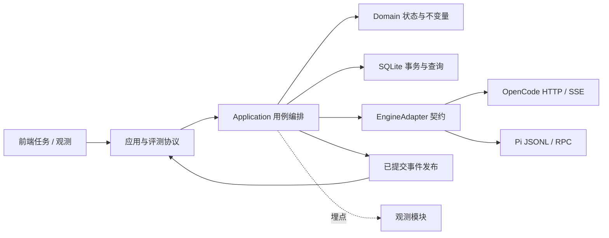
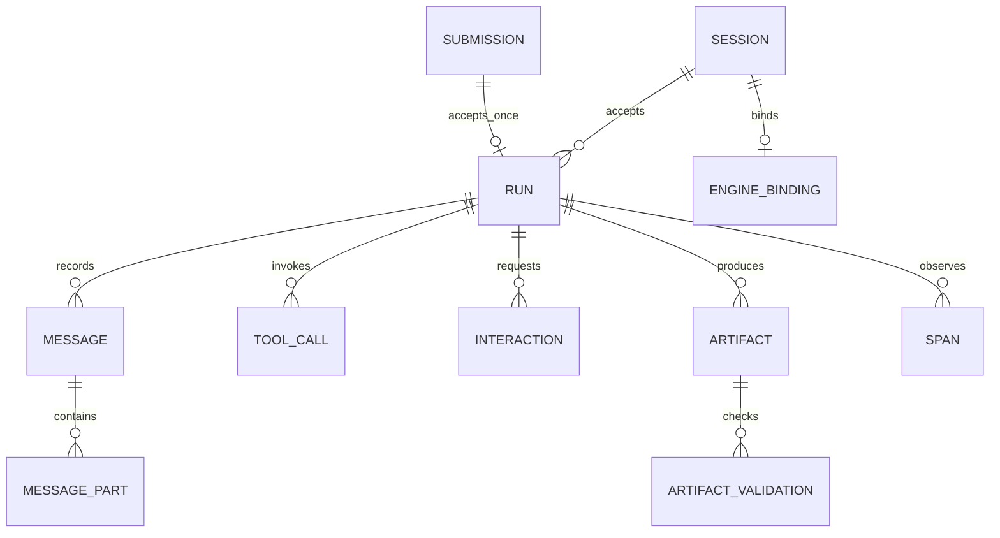
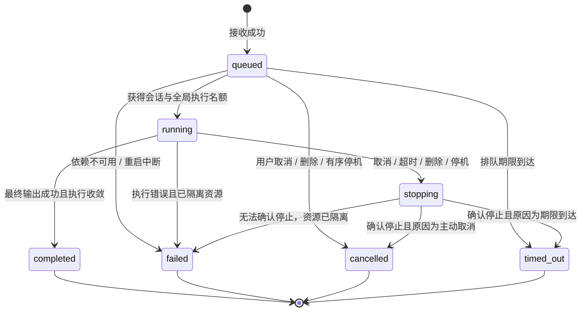

# 领域模型与不变量

本文定义与引擎、HTTP 框架、数据库驱动无关的业务模型。术语见 [GLOSSARY](GLOSSARY.md)，线上格式见 [CONTRACTS](CONTRACTS.md)。领域模型用于约束实际实现，不要求为每个名词建立类、微服务或 Repository。

## 1. 领域边界

| 边界 | 负责的业务事实 | 对外能力 |
| --- | --- | --- |
| 会话与执行 | Session、Run、接收、排队、取消、唯一终态 | 创建、接收、调度、取消、删除 |
| 执行记录 | Message、MessagePart、ToolCall、标准轨迹 | 按稳定 ID 合并、查询、结束校验 |
| 人机交互 | Permission、Question、策略和回复归属 | 待处理查询、自动/人工回复、过期 |
| 产物 | Artifact、来源、访问范围、检查结果 | 登记、校验、下载、受限预览 |
| 引擎管理 | EngineBinding、生命周期、健康、进程归属 | 原生执行与统一契约之间的转换 |
| 运行观测 | 指标、日志、trace、异常提示 | 查询和导出已发生事实，不控制任务状态 |

这些边界位于同一服务中。执行层拥有业务状态的修改权；观测与前端只有投影和操作入口，不能各自维护可以反写的执行状态机。

Domain 不导入 Fastify、React、SDK、文件系统或数据库。Application 负责事务、时钟、ID、取消控制和调用适配器。Infrastructure 实现存储、传输、进程、文件访问与遥测。Presentation 处理请求校验、身份边界、序列化及 SSE。

## 2. 实体关系

Task 不单独建表，是 Session 的读模型。ToolCall 是执行事实，消息中的 tool part 是它在消息流中的展示引用；两者在同一次事务更新，不能出现两份可独立修改的工具状态。

### Session

必要字段：`id, title, directory, engineId, interactionPolicy, availability, createdAt, updatedAt, activeRunId, version`。

- Session 是执行一致性边界。同一 Session 中开始 Run、更新队列、取消和删除必须串行提交。
- directory 在创建时解析真实路径、验证存在和允许范围，之后不可修改。真实路径相同的两个 Session 仍不保证文件操作互相隔离，UI 与交付文档必须明确共享文件风险。
- engineId 在创建后固定。停用该 Agent 时历史可读、禁止追加；重新启用并成功恢复原生绑定后才恢复接收。
- `availability` 为 ready、unavailable、deleting；原生创建中的尝试由 Submission/创建操作记录承载，不能作为创建成功的 Session 返回。
- `version` 用于内部并发检查；全局快照 revision 是不同概念。
- `activeRunId` 最多一个。排队顺序从 Run 的接收序号读取，不在数据库与引擎分别维护两套队列。

### Run

必要字段：`id, sessionId, submissionId, sequence, inputParts, model, state, acceptedAt, deadlineAt, startedAt, finishedAt, stopRequest, error, usage, traceId`。

Run 记录选定模型与实际已应用的 configRevision。Session 保留连续上下文，Run 划分一次用户提交的排队、超时、取消和用量边界；不新增 Turn 聚合。

`stopRequest` 包含 `reason: user | timeout | deletion | shutdown`、请求时间及停止确认信息。错误包含固定类别、阶段和对外安全文案。usage 允许 null，不能用预填的零值代表引擎没有提供用量。

Run 是 Session 的子实体，也是观测统计与取消追踪单位。队列里的 Run 已被接受但还没有写入会话消息历史；开始执行时再创建 user Message，避免污染当前轮的最后一条消息。

### Message、MessagePart 与 ToolCall

Message 字段：`id, sessionId, runId, role, createdAt, completedAt, finishReason`。role 在统一模型中为 user 或 assistant；原生工具结果归入 ToolCall 和对应 tool part。

MessagePart 是判别联合：

| type | 内容 |
| --- | --- |
| text | 完整 text，稳定 partId，是否已完成 |
| tool | toolCallId 与规范化工具状态、输入、输出和错误 |
| step-finish | 当前模型步骤结束原因与实际可得用量；不自动终止 Run |

ToolCall 字段：`id, runId, messageId, nativeCallId, name, input, output, state, startedAt, finishedAt, error`。原生动态名称归一化后才用于指标标签，原名可保留在受控执行记录中。

文本流按 partId 合并；原生累计内容覆盖，原生 delta 仅在适配器已确认顺序与唯一性时追加。迟到的旧 run、旧进程代次或终态消息不得覆盖新一轮。

引擎没有明确工具终态、但进程已退出时，未完成工具标记 interrupted，不能伪造 completed。底层工具失败可被 Agent 修复，因此不直接决定 Run 失败。

### Interaction

必要字段：`id, sessionId, runId, kind, payload, state, policy, claimedBy, claimedAt, resolvedAt, reply, error, expiresAt`。

- kind 为 permission 或 question，payload 使用不同 schema。
- 权限决策为 once、always、reject；always 的作用范围遵循原生会话或引擎配置，不推导为网关永久授权。
- 问题支持多个问题、选项、是否多选和自由文本约束；答案按问题顺序对应，不能把整组问题拼成一句回答。
- claimedBy 为自动策略或当前人工回复操作。pending 到 replying 必须原子认领，重复请求不能双发到引擎。
- 原生请求已过期或 Run 已终止后标记 expired，返回明确冲突，不继续回复。
- 回复传输失败且无法确认是否生效时，保留 replying 与错误并进行有界核对；不能盲目退回 pending 后再次自动发送。明确未提交的失败才可以退回 pending。

### Artifact 与 ArtifactValidation

Artifact 字段：`id, sessionId, runId, relativePath, displayName, mediaType, sizeBytes, modifiedAt, digest, registeredAt, availability`。

访问路径由 Session 的受控目录加相对路径解析。每次访问重新验证真实路径与符号链接、文件类型及存在性；文件改变后原 digest 和检查结果标记陈旧。登记支持工具结构化结果，或有明确来源的文件发现流程；不能通过从自然语言提取一个路径就宣称产物存在。

ArtifactValidation 字段：`id, artifactId, status, scope, validator, validatorVersion, checkedAt, digest, details`。scope 区分可打开、结构完整、表格数据、特定业务规则或评测结果。检查通过只对该文件版本和 scope 有效。

删除会话删除登记记录和受控中间数据；默认不删除用户指定工作目录、原始文件或最终产物。用户要求的文件删除是 Agent 工具操作，有独立轨迹。

### EngineBinding

字段：`sessionId, engineId, nativeSessionId, directory, instanceId, processGeneration, status`。双向映射键包括 engine、原生 ID、目录和进程代次，防止 ID 重用。

进程句柄、AbortController、Promise、socket、订阅函数与计时器只存在于 RuntimeContext，不写入持久化实体。历史 EngineBinding 只能解释轨迹，不能在重启后当作仍然可执行的连接。

### Submission

字段：`id, operation, sessionId?, payloadDigest, status, acceptedResult?, rejection?, createdAt, expiresAt`。

- submissionId 为客户端业务提交幂等键；requestId 为单次 HTTP 关联标识，两者独立。
- 唯一约束覆盖 operation、目标 Session 和 submissionId。摘要基于校验后的规范化请求，不依赖 JSON 字段原始顺序。
- status 为 processing、accepted、rejected、indeterminate。进程在原生会话创建和数据库提交之间退出时，结果可能不确定，必须核对或清理后明示失败。
- accepted 与 Run 接收结果在同一事务保存。重试相同内容返回原结果；同键不同内容返回 CONFLICT。
- 去重只能保障约定窗口内的网关接收，不保障模型或外部工具副作用 exactly-once。删除后的键在 tombstone 保留期内返回已移除状态，不能静默当作新业务请求；记录彻底过期后无法判断其历史，客户端不得用旧键自动重发。

## 3. Run 状态机

终态最多提交一次。`finishedAt`、completion Promise、最终事件和业务终态统计共用这一次提交点。等待人工交互不增加 RunState，仍然计入 running 与执行预算。

停止意图在终态之前提交时，迟到的正常结束不能覆盖停止意图。若正常终态已经提交，后续取消为幂等空操作。领域逻辑比较截止时间并使用可注入时钟测试边界；进程内耗时使用单调时钟，跨重启保存 UTC 时间。

`stopping` 不能无限停留：先请求引擎中止，超过取消预算则停止拥有的进程树；仍无法确认时隔离资源、标记 failed 并记录 `STOP_UNCONFIRMED`。在此状态下不能把会话重新标为 ready。隔离不等于已证明所有外部副作用结束，异常必须可见。

业务取消接口默认为停止 Session 当前轮及全部排队轮。若赛题原文另有范围，差异由评测命令映射处理，不能改动已有应用操作的含义。

## 4. 状态投影顺序

TaskView 不接受直接赋值，按下列优先级计算：

1. availability 为 deleting，显示 deleting。
2. 仍有 stopping Run，显示 stopping；即使引擎已异常，也要显示清理未完成。
3. availability 为 unavailable，显示 unavailable，并附最后 Run 结果。
4. active Run 有需要人工处理的 pending/replying Interaction，显示 waiting_input。
5. 有 active running Run，显示 running。
6. 有 queued Run，显示 queued。
7. 有最后终态 Run，显示其 completed、failed、timed_out 或 cancelled。
8. 否则显示 not_started。

赛题 SessionStatus 只判断是否存在非终态 Run，存在为 busy，否则 idle。前端不自行重写投影算法；详情同时提供 availability、当前 Run 状态和最后结果用于解释。

## 5. 核心不变量

| 编号 | 必须成立的条件 |
| --- | --- |
| INV-01 | 一个 Session 最多一个 running/stopping Run；全局执行数不超过配置上限 |
| INV-02 | 所有已接受的 Run 都持有明确期限、队列位置与最终可查询结果 |
| INV-03 | 终态只能提交一次；终态之后不再变更该轮业务输出或用量账目 |
| INV-04 | completed 必须有引擎收敛证据及最终成功 assistant，不能仅看 idle 或步骤结束 |
| INV-05 | 同一轮消息、交互和产物始终带同一 sessionId/runId；原生事件须先验证绑定代次 |
| INV-06 | 状态与事件在事务中一致提交，发布发生在提交之后 |
| INV-07 | 取消未确认或资源未隔离前，不允许下一轮使用相同执行资源 |
| INV-08 | deleting/unavailable Session 不接受新 Run；删除失败保留清理记录 |
| INV-09 | 同一交互最多一名回复者持有处理权；未知回复结果不能盲目重发 |
| INV-10 | 在公布的去重窗口内，幂等键不能因并发请求、进程重启或响应丢失而产生第二个 accepted Run |
| INV-11 | 未知 token/cost、未检查产物与未采集指标必须保持未知 |
| INV-12 | 访问产物不得越过会话目录或允许范围；删除会话不删除用户工作文件 |
| INV-13 | 队列、事件、日志、消息、文件预览和回放均有容量边界，超限明确返回或标记 |
| INV-14 | 浏览器、HTTP/SSE 连接生命周期不能成为 Run 生命周期的所有者 |
| INV-15 | 重启不重放业务操作；未完成任务明示中断，旧上下文不可用时禁止继续 |

## 6. 接收与提交事务

接收流程：校验输入和目录 → 原子认领 Submission 与创建/接收配额 → 必要时创建原生会话 → 同一事务写 Session、queued Run、幂等结果和事件 → 释放临时保留额度 → 返回接收结果。

原生会话创建属于外部 I/O，禁止在持有数据库写事务期间等待。每次尝试都有明确所有权、超时和补偿清理记录；创建失败或最终事务失败必须清理本次拥有的原生资源。清理失败记录为运维异常，并阻止相同尝试无界重试。

执行流程：同一事务认领队首 Run 并创建 user Message → 事务外调用 adapter.run → 对回调做绑定、顺序及容量校验 → 批量提交消息和事件 → 同一事务提交最终消息与终态 → 唤醒完成等待者并发布事件。

高频文本可在 20..50ms 内合并成完整 part 快照，每批原子提交；结束前必须 flush。不能发出尚未持久化的最终文本；中途崩溃只承诺保留已提交进度，并明确最终 run 中断。

全局名额认领与 Session 队首认领需要同一调度临界区。不要在等待引擎网络响应时持有全局锁；数据库事务保持短小。调度按可运行 Session 公平选择，不能让一个长队列持续占用全部名额。

## 7. 持久化与恢复

默认 SQLite 存储以下记录：sessions、runs、messages、message_parts、tool_calls、interactions、artifacts、artifact_validations、submissions、engine_bindings、events、schema_migrations。关系通过外键与唯一约束表达，JSON 仅用于实际可变的工具参数、结果和事件 payload。

事件是事务提交后的可靠通知记录，不是领域唯一数据源；不通过全量事件重放重建数据库。默认仅一个网关拥有一个数据目录，第二个写入实例启动失败。SQLite 放在本地磁盘，备份走一致性备份方式，不直接复制运行中的单个数据库文件而漏掉 WAL。

启动恢复顺序：取得数据目录锁 → 检查/迁移 schema → 创建 instanceId → 核对并清理旧实例拥有的残留进程 → 收尾旧实例的非终态 Run → 将不可确认恢复的绑定标记 unavailable → 使旧 Interaction 过期 → 记录恢复事件 → 启动已启用 Agents → 分别开放接收。

残留进程必须通过所有权记录、创建时间和启动身份核对，不能只凭 PID 终止进程。无法确认停止的执行资源及其工作目录保持隔离，禁止新的任务继续使用；解除隔离需要明确的清理确认，不能仅因新引擎启动成功就取消隔离。

旧 queued Run 不自动继续；旧 running/stopping Run 不自动重发。它们以 failed 和 `GATEWAY_RESTARTED` 原因结束，`executionCertainty` 记录无法确认的副作用。已完成历史可查；用户创建新会话才能在不可恢复上下文情况下继续。

持久化失败时不得返回 202/204；降低 readiness、拒绝新写入，尝试停止在途执行并暴露故障。已有只读数据可在数据库可读时查询。遥测导出失败可以有界降级，但业务状态写入失败不能仅记日志后继续宣称成功。

内存模式使用同一状态和契约测试，明确展示重启丢失历史；不能作为完整版本默认启动配置。

## 8. 保留与配额

初始默认值是可配置运行限制，不是未经测试的性能承诺：Run 总预算 600s、原生启动 30s、取消等待 10s、每会话排队 16、全局执行 4、会话上限 100、SSE 连接 100。精确资源阈值根据 Windows 实测调整并记录。

业务历史默认保留至用户删除，受磁盘与记录配额约束，达到上限拒绝新接收并给出清理入口；不得静默删除活跃会话。事件默认保留 24h 且最多 100000 条，先到者触发清理；过期游标触发快照恢复。

观测采样默认 5s，查询窗口与本地保留配置一致；日志与 spans 分别有大小/条数上限。工具输出超过展示上限时保留截断标记和真实受控文件引用，禁止无限内存累计。具体字节限制统一放入配置与 API runtime 描述。

幂等记录在其 Run 存在期间保留；删除后的 tombstone 默认保留 7 天。API 明确去重窗口，不能声称无限时间 exactly-once。所有自动清理有审计和计数，清理操作不调用 Agent。
