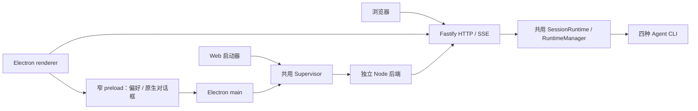

# Web 与 Desktop 统一运行

更新：2026-09-08。当前版本不兼容历史配置、数据库或运行时清单，不提供迁移、导出转换或兼容入口；使用新数据目录重新配置。配置和数据库版本为 3，运行时清单和系统网络配置版本为 1。同一当前版本内的失败回滚和中断恢复保留。

## 统一结果与保留的差异

| 功能 | 当前共同实现 | 平台差异 |
| --- | --- | --- |
| Agent、模型、任务、审批、产物、观测 | 同一 React 页面、Fastify API、SessionRuntime、SQLite | 无业务分支 |
| CLI 来源 | 每个 Agent 独立选择 managed 或 external；默认受管，安装不启用 | Desktop 自带 Node/npm，源码入口发现并校验主机 Node/npm |
| 版本管理 | 实际检测文件与版本，检查最新版本，受管安装/更新/卸载，来源切换与回滚 | 外部程序始终不被覆盖或删除 |
| 网络配置 | `host/network.mjs` 规范化代理、认证、绕过地址和 CA；`system.json` 保存修订与生效状态 | Electron 更新器使用自己的 Session 网络栈，并应用同一代理策略 |
| 重启/退出 | `host/supervisor.mjs` 管理同一个 Node 后端，支持等待或停止任务 | Desktop 另有窗口、托盘和应用更新；Web 的退出结束启动器 |
| 管理访问 | Web、API、SSE、文件与指标无需配对或鉴权；保留输入、路径、Origin 校验与 CSP | Desktop 保留沙箱及受限 IPC |
| 工作目录、Skill 路径 | 后端目录边界校验 | Desktop 原生选择器；Web 浏览服务器目录，上传 PEM 到服务器 |
| 偏好和草稿 | 业务草稿与待确认提交按 storeId 隔离 | 浏览器偏好本地保存；Desktop 通过窄 IPC 持久化主题和侧栏 |

`pnpm dev` 使用已安装的 tsx 在启动器外层监听源码变化，保持 Supervisor 与后端直接通信；自动重载会重建启动器。Web 页面直接连接，无需配对。

Web 的目录是服务器文件系统，不是远程浏览器所在电脑。不能通过浏览器文件选择推断服务器绝对路径。两种入口默认各自的数据位置，格式一致；同一目录只允许一个实例运行，不自动寻找、合并或迁移另一入口的数据。

## 进程与接口边界

业务前端不通过 Electron IPC 管理网络或 Agent。后端与 Supervisor 通过私有父子 IPC 通信，含请求 ID、并发上限、超时和断连拒绝。只接受固定的系统操作，不暴露任意命令执行接口。Node 使用独立进程组；后端失去父 IPC 后退出，Supervisor 和引擎启动器负责后代清理。任务恢复依赖已有状态机，不重新提交旧 Run。

| 接口 | 语义 |
| --- | --- |
| `GET/PUT /api/system/gateway` | 查询或保存监听 host/port，revision 校验，重启生效 |
| `GET /api/docs`、`GET /api/examples/evaluate.mjs` | 随安装包提供的接口文档和自动评测脚本 |
| `GET /api/system` | 应用版本、storeId、实际 Node/npm、能力、维护状态 |
| `GET/PUT /api/system/network` | 脱敏网络设置；PUT 为 `{settings, revision}`，冲突返回 409 |
| `POST /api/system/network/test` | `{settings, url}`，独立 Node 测试草稿，返回 HTTP 状态与耗时 |
| `POST /api/system/lifecycle` | `{action: "restart"或"shutdown", mode: "wait"或"stop"}`，202 表示接受 |
| `GET /api/system/directories?directory=…` | 服务器目录浏览，realpath 防止软链越界，最多 500 项 |
| `POST /api/system/certificates` | `{pem}`，验证 PEM/X509，最多 2 MiB，按内容去重保存 |
| `PUT /api/runtimes/:id/source` | `{mode: "managed"}` 或 `{mode: "external", command: "…"}`，来源验证与后台切换 |

Pi 的 MCP 扩展从实际 CLI 安装位置解析，两种来源使用相同逻辑；外部 Pi 使用 MCP 时需在其 Node 模块搜索范围安装 pi-mcp-adapter。

外部来源可执行 detect、check、install、cancel。install 只准备受管程序，当前外部 Agent 继续运行；准备完成后单独切换。切换先验证候选协议，暂停受影响 Agent 的新任务并等待活动执行，停止原生进程，再备份原生状态和绑定、修改来源并恢复会话。失败恢复原来源，其他 Agent 不受影响；未能确认原生上下文恢复时显示失败。

## 网络、生效与凭据

保存网络配置不修改现有进程；`revision` 和 `appliedRevision` 分别表示保存与生效值。启动/重启前应用环境，回环流量强制直连。应用失败保留保存值、恢复此前生效值并显示错误；中断记录用于当前版本的恢复。等待期间拒绝新的修改与提交，保留审批和任务停止入口。

测试结果仅证明网关 Node 对目标 URL 的访问情况。每个 Agent 的模型链路仍在模型页面单独测试；不能从网关测试推断所有原生 CLI 的代理和 CA 支持。系统 CA、`NODE_EXTRA_CA_CERTS` 作用于支持它们的进程；Electron 更新器信任操作系统证书，不把 PEM 文件当作更新器根证书。继承环境模式不读取操作系统代理或 PAC。

Desktop 使用异步 safeStorage；不可用时明确显示文件权限保护，不声称拥有系统密钥保护。Web 的网络凭据以仅当前用户可读写的文件保存。API 不回显密码；省略密码保留，显式空字符串清除。代理凭据不放入 URL 输入框、不传给 renderer 初始化数据。

Web/Desktop 本机与局域网接口不要求配对码、Cookie 或 Bearer token。网关监听设置存入 system.json 的 gateway/appliedGateway，默认 127.0.0.1:3000。保存后用现有生命周期流程重启；失败恢复之前的监听与网络配置。Desktop 在地址改变后重新加载工作台，Web 使用新地址访问。启动时 Web CLI > 环境变量 > 已保存配置；运行期间 API 可更新设置。完整字段和评测示例见[网关 API](../../code/docs/GATEWAY_API.md)。

## Electron 官方实践与项目选择

保留 sandbox、contextIsolation，关闭 nodeIntegration，校验 IPC sender/main frame、限制导航与新窗口，外链只允许经校验的 HTTP(S)，为内容设置 CSP。这些要求来自 [Electron Security](https://www.electronjs.org/docs/latest/tutorial/security)。

preload 每个系统能力提供一个明确方法，避免暴露 ipcRenderer 或通用 invoke；初始化和偏好持久化均为异步。依据 [Context Isolation](https://www.electronjs.org/docs/latest/tutorial/context-isolation) 和 [Performance](https://www.electronjs.org/docs/latest/tutorial/performance)。密码保护采用 [safeStorage](https://www.electronjs.org/docs/latest/api/safe-storage) 的异步接口，并区分 Linux basic_text 与系统密钥存储。

Node 后端继续作为独立 Node 进程运行：这样 Web 无需 Electron，桌面受管安装也使用相同且明确的 Node/npm。Electron 的 [utilityProcess](https://www.electronjs.org/docs/latest/api/utility-process) 适合依附 Electron 的 Node 工作进程，但不是本项目统一后端必须采用的方式。代理与 CA 在创建 Node 进程之前注入，遵循 [Node CLI 环境变量](https://nodejs.org/api/cli.html#node_use_env_proxy1) 的启动语义。

构建时先清空后端输出，删除的旧模块不会进入分发包。Linux 的构建、开发态及搬到仓库外的包体冒烟测试验证共享 host 模块、内置 Node/npm、代理认证、循环连接、偏好、访问隔离与退出。Windows/macOS 的实机、密钥存储与签名更新仍需目标平台验收；不将 Linux 结果写成三平台实测。

## 统一运行基线验证（鉴权清理前的历史记录）

- 后端：62 项，56 通过、6 项按环境条件跳过；另单独运行 Pi/OpenCode 真实进程生命周期测试，两项均通过；Pi 真实 CLI 配合本地模型 fixture 的工具/MCP 链路也通过。
- 浏览器：68 项，64 通过、4 项跳过，覆盖桌面/手机视口、访问配对、共享网络和 CLI 管理。
- 前后端类型检查、前端 lint、生产构建、Linux 目录包构建通过。
- Electron 开发态及移至仓库外、清理主机 Node 搜索路径的 Linux 目录包冒烟通过；验证共享 API 重启、storeId、端口、SSE 重连、代理认证、偏好和退出。
- 回归包含网络启动失败回滚、网络应用中断恢复、来源切换失败与日志恢复、历史格式拒绝和开发监听重载。证据对应测试源码，不把模拟模型结果视为真实模型业务验收。

已删除 Desktop 网络 IPC 和重复网络模块、重复鉴权/维护守卫、历史数据库升级代码及迁移工具。旧构建输出在每次构建前清空，普通浏览器回归产生的无关截图改动已撤回。前次 AppImage/CLI 下载记录仍作为历史验收证据保留，并已标明其范围。

## 网关开放与监听配置验证（2026-09-08）

本次移除 Web/Desktop 配对与网关鉴权，新增共享监听配置、桌面改址重连、离线 API 文档和 Node 自动评测脚本。

- 前后端类型检查、Web lint 和生产构建通过；后端 63 项通过、6 项按环境条件跳过；浏览器 72 项通过、4 项跳过。
- 回归覆盖无凭据 HTTP/SSE、局域网监听、配置修订冲突、改端口、端口占用回滚、完整启动器重启后的持久化，以及评测脚本成功/取消退出码。
- Linux x64 目录包构建、Electron 开发态和移至仓库外的包体冒烟通过；包体测试清除主机 Node 搜索路径，验证内置 Node/server、文档、配置页面、自动重连、代理、偏好和退出。
- 图形测试使用 Xvfb，并通过测试环境变量关闭 Chromium 启动沙箱；生产代码仍启用 sandbox/contextIsolation。Windows/macOS 安装包和真实供应商模型未在本次测试。
